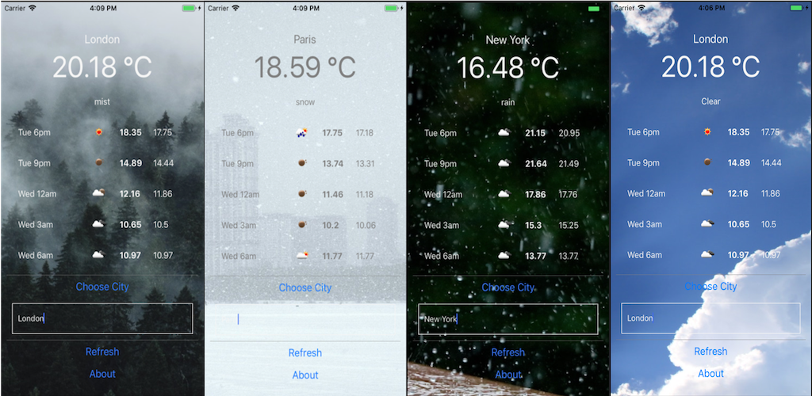

# Weather++

## Overview

Weather++ is an easy to use and beautifully-designed tool that allows you to see
the current weather and a 5 day forecast in any city in the world! (Note: currently only for Earth).

You can see the current weather and a detailed a 5-day/3-hour forecast 
of the weather in that city.

The app has a dynamic background image that will show an picture representing the current weather 
conditions for the selected city.

This is a cross-platform app created with React Native.

Get it now on the [Play Store](https://play.google.com/store/apps/details?id=com.weathermobileapp) and the [App Store](https://apps.apple.com/ng/app/weather/id1464688872?ign-mpt=uo%3D2).

## Features:
* Text input area to type in name of the city
* Text input area will automatically 'slide up'/'slide down' when you interact with the keyboard
* The top area shows the current weather and conditions in selected city
* Area to see 5-day/3-hour forecast in current city, scrollable to see more information. Includes conditions description, conditions icons, and max/min temperature
* Background dynamically changes based on current weather conditions
* Ability to refresh data at the click of a button (data on server is updated every 10 minutes)

## Technology features
This app uses a wide variety of React Native features available on both iOS and Android.
* ScrollView to enable smooth scrolling behaviour
* 'Pop-up' modal component to show information
* Networking - data fetching from multiple endpoints using modern async/await syntax
* Responsive styling with Flexbox
* Working with images and external links
* Testing with Jest + Enzyme, CircleCI.
* Accessibility labels added to buttons etc.

## Data
* Data is provided by [OpenWeatherMap](https://openweathermap.org/api). Please note there is currently limit on of 60 requests per minute (across all users!) so please be patient.
* Data is refreshed on the server every 10 minutes.

## Photo
Photo credits:
* Raindrops photo by [Liv Bruce](https://unsplash.com/photos/8yt8kBuEqok?utm_source=unsplash&utm_medium=referral&utm_content=creditCopyText) on Unsplash

* [Fog](https://unsplash.com/photos/7CME6Wlgrdk?utm_source=unsplash&utm_medium=referral&utm_content=creditCopyText) photo by Annie Spratt on Unsplash Photo by Annie Spratt on Unsplash

* [Haze](https://unsplash.com/photos/c2-SgQFsyV4) photo by Karsten Würth (@karsten.wuerth) on Unsplash

* [Clear sky](https://unsplash.com/@sam) photo by Sam Schooler on Unsplash

* [Dust](https://unsplash.com/search/photos/dust) photo by Dmitry Sovyak on Unsplash

Logo built on example from [Free Pick](https://www.freepik.com/) from [Flat Icon](https://www.flaticon.com/)

## Data
Data is provided by OpenWeatherMap. Please note there is currently limit on of 60 requests per minute (across all users!) so please be patient.

## Privacy
None of the data you enter into the app is stored or logged by us.

## Support
Please either raise a Github issue or email sam_ollason@hotmail.co.uk with any support questions.
